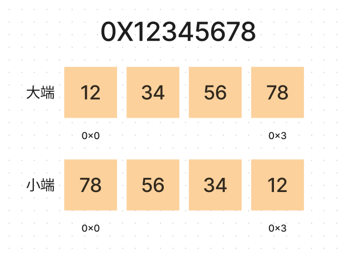

计算机最重要的一个功能是存储。

## bit 与 byte

计算机最小存储单元为一个 bit，通常通过高低电平来代表状态。8 个 bit 组成一个 byte，现代计算机中，byte 是读写的最小单元，**寻址和申请空间也是以 byte 作为最小单位**。我们无法直接操作一个 bit，只能通过语言提供的位操作进行一些相关的操作。

## 堆内存和栈内存

每个线程都有一个固定大小的栈空间，不同的操作系统提供的大小不同，截止 2023 年，在 linux 下为 8m 左右，这个空间由线程独有，所以是线程安全的。需要注意的是，这个空间是虚拟空间，实际上物理空间的消耗看实际使用情况。

每个进程都会有一个线程内部共享的堆内存，可以通过 api 动态分配和释放。所以，对堆内存的访问是线程不安全的。

为了避免在栈上申请的空间和堆上的空间冲突，他们分配时在地址上是相反的。堆内存的分配会从低地址到高地址，栈内存的则从高地址到低地址。

## 数据存储大小端

如果一个类型由多个字节组成，那么如何排列这多个字节有两种方向，由 CPU 架构决定。通常由 CPU 数据引脚和地址总线连接方式决定。

现在我们使用的 arm64 和 x86 架构都是小端，大端则存在于 IBM、PowerPC 等的 cpu 架构中。但是网络通讯协议也是使用大端的方式进行数据传输的。

大小端只是多字节类型内部存储方向不同，其首地址和占用字节数在大小端系统下是一致的。

### 比特序

上面我们图中最小单位为 byte，那其中 bit 的顺序是什么样子的呢。

其实 bit 序也是相反的，只不过因为系统屏蔽了 bit 序的一些细节，例如位运算也是透明的，我们在大小端转换时只需要以字节作为最小单位处理即可。

### 只决定多字节单类型的存储顺序

大小端只决定了多字节单个数据的存储顺序，而与不同类型多个数据的存储顺序并无关系。
