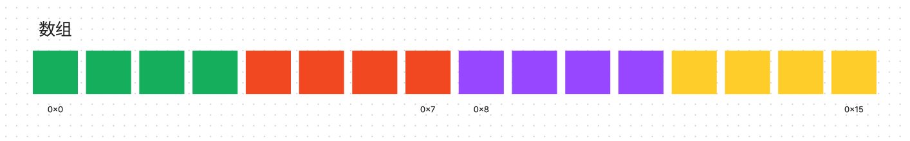

数组，连续存储的多个相同类型变量。

## 数组

前面我们学习了单个数字或者字符的存储，如果我们要存储多个数字，就需要一个一个的去申请空间，代码可读性无法得到保证。

数组最早出现就是为了方便一次声明多个变量，只不过这些变量是匿名的。我们通过数组的名称和特定的访问规则去操作他们。

## 空间连续与类型相同

数组是空间连续的，其子元素紧凑排列。数组中存储的数据类型是相同的，每个元素占用相同的空间让随机访问更迅速。

如果我们要访问下标为 7 的元素，只需要首地址加上 6 \* 子元素占空间数就可以直接访问了，如果子元素是变长的，我们需要计算出前面六个元素的长度才能得到第一个元素的偏移量。

### c 语言的字符串

利用数组空间连续和类型相同的特性，在字符数组的末尾加上一个特殊字符\0 作为字符串的边界，我们就可以通过字符数组来表示一个字符串了，这也是它们之间唯一的区别。

### 定长与变长

数组在定义后就**不可以修改其长度**。主要是因为数组是由编译器在编译时就确定好大小并从栈上分配空间的，数组本身要求空间连续，但其后面已经存在其他变量了，没有可申请的连续空间。

**动态定长/VLA**

c 语言在 c99 加入支持通过变量定义一个数组，但并不是所有编译器都实现了此特性，因为这个特性是可选的。

这种方式并没有太多的好处，这个数组仍然是定长的，无法自动拓展。栈空间是非常宝贵的，并且这种方式各个编译器的实践都有较大区别。

其中一种实现是先在栈中划出一片特定的空间，然后在 VLA 未初始化前先使用某个占位符，等真正初始化时，从那片特定空间内分配好后将地址回写到之前的占位符处，后续的访问都需要两次访存。

## 在堆上面申请数组

每个进程都有一块空间，可以通过 api 手动释放和申请，所以很容易出现内存泄漏的问题。部分语言提供了 GC 功能，根据某些算法定时去检查这一块区域，判断是否未使用但未释放的空间。

在堆上面申请空间的 api 在 c 语言中以 alloc 结尾，不同的 alloc 函数可能有细微区别，例如 calloc 会将空间初始化。释放空间的函数为 free。

## 自动扩容数组

在部分语言中，存在一种动态数组类型，例如 java 中的 ArrayList 和 c++ 中的 vector，在 go 中叫做 slice。它们可以动态地增加或删除元素，而不需要手动调整数组的大小。其分配方式与之前提到的可变字符串类似，在先前分配的数组连续空间不够时，分配一个更大的空间并将之前的数据复制过去。
