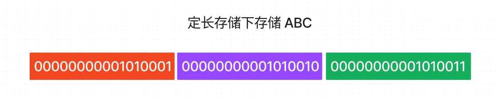
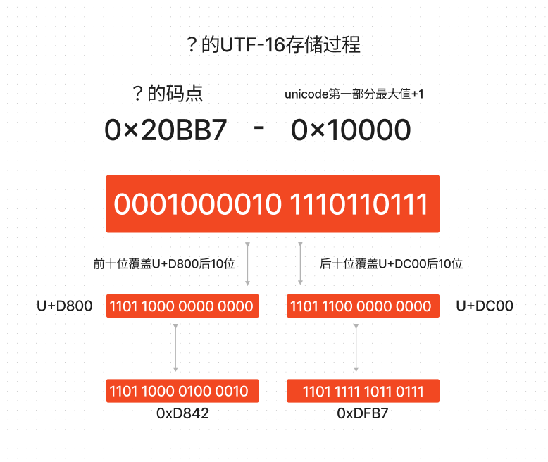

字符，编程的基础。

## 字符与编码

计算机只能存储数字，那么应该怎么存储一个英文字母或者汉字呢。最简单的办法，就是给每一个英文字母或者汉字都指定一个对应的数字，这个对应关系就是编码表。

计算机底层最常见的编码表是 ASCII 编码，这个编码表总共定义了 128 个字符和数字的对应关系，包含了英语的 26 个字母和大部分键盘上能看到的字符。既然字符在硬盘上存储的也是数字，那我们怎么确定存储在硬盘上的数字代表的是一个字符还是就是一个数字呢。答案是通过类型，在 c 语言中，一个数字使用 int 类型赋值则为数字，使用 char 类型赋值则为 ASCII 字符。

需要注意的是，在不同的语言中，char 类型所占用的长度并不同，因为不同语言使用的编码表不同。在 c 系列语言中为 1 个字节，因为使用的是 ASCII，在 java 则为 2 个字节，因为使用的是 unicode 编码。

### 什么是 unicode

上面我们介绍了 ASCII 编码表，通过约定 char 类型的编码表为 ASCII，我们能够实现英文字母和部分常见字符的存储和取出。但是，我们无法存储汉字，因为 ASCII 上面并没有汉字对应数字的对应关系。

因此，我们需要有一个表，上面将所有语言的所有字都对应一个数字，这个表就是 unicode 表。语言是不断在变化和拓展的，所以 unicode 表也在一直更新中，截至 2023 年，最新版本为 15.0 版本，其规模有十五万个左右的字符，其中包含大量的 emoji 表情字符。

[unicode 官网](https://home.unicode.org)

因为 ASCII 编码表是固定的，存储 128 个字符的最小内存单元就是一个字节。所以，采用 ASCII 编码作为字符编码方式的语言中，一个字符都只占用一个字节。但是，如果一个语言采用 unicode 编码存储字符，它的字符会占用多大的空间呢？

### 什么是编码空间

由于码表在不断的变大，所以我们需要先约定一个字符对应数字也就是码点的范围，这个范围必须大于现在已经编码的字符的总数，并且还需要考虑到字符不断增长的情况，这个约定的范围就是编码空间。由于 ASCII 码表是不变的，所以它的编码空间是 0-127。但是 unicode 编码一直在变化，编码空间与其版本有关。

现行的 unicode 版本，将编码空间划分为 17 个部分。第一部分范围为 0-65535，第二部分范围为 65536-131071，第十七部分为 1048576-1114111，所有最常见的字符都放在第一个范围内（常见汉字在第一部分，生僻字则不在第一部分），unicode 最早的编码空间也就是第一个范围，后续随着编码表的变大，才拓展成现在的 17 个部分。如果要将前面说的十七个部分都存起来，需要 21 位，也就是三个字节，但是我们一般不直接将每个 unicode 直接存储为三个字节，后续会提到原因。

### UCS

unicode 编码由统一码联盟定义，但是不是官方的标准。国际标准化组织定义的编码规范为 UCS。现在的版本中，两个编码是兼容的，但是 UCS 有 31 位的编码空间，也就是需要 4 个字节，与 unicode 重叠的 21 位编码空间内的字符码点对应关系是相同的。

## UTF

我们现在已经知道，所有字符都可以通过 unicode 编码表查找到对应的数字，然后以数字的方式存储到内存中。这个数字怎么存储，现在流行的有两种处理方式。

### 1. 定长存储

字符的码点，直接使用数字的方式存储，不经过任何转换。每个字符都分配一样的空间，如果采用 unicode 并且想支持所有 21 位编码空间，则所有字符都使用 3 个字节来存储。采用 UCS 并希望支持所有 31 位编码空间，则所有字符都使用 4 个字节来存储。如 utf-32/UCS-4 就是如此，所有字符都使用 32 位存储，并且码点也不会进行任何拆分就直接存储到这 32 位空间中。

这种方式是最简单的，但是存在一个很大的问题，就是英语和常见字都只占用 1 到 2 个字节，也就是说，他们的数字通常小于 65535，但是却分配了三个或者四个字节的空间，这样的话，绝大部分字符高位都会存在大量的补 0。这种存储方式对内存和带宽都造成严重浪费，一定程度上阻碍了 unicode 编码表的推广。

### 2. 变长存储

将一个整数拆分成多个字节进行存储，并且约定每个字节前面几位拥有特殊含义。这样，通过单个字节前面的位，就可以找到所有的被拆分出来的字节，计算出本来的码点然后通过 unicode 编码表找到对应的字符。

### UTF-8

utf-8 是现在使用最广泛的码点转换算法，它的规则如下：

#### 1. 拆分出来的第一个字节前面的前缀码用来标识这个码点拆分的字节数。

例如：如果码点拆分成三个字节，则这三个字节的第一个字节的前缀码为 1110，也就是说，第一个字节只有 4 位有效位了。两个的前缀码则为 110，一个的情况比较特殊，为了兼容 ascii 编码表的所有字符，如果目标字节为一个字节，那这个字节的前缀码为 0。

#### 2. 拆分出来的第二个字节开始前缀码均为 10

例如：如果码点被拆分成两个字节，则这个码点实际存储为 110xxxxx 10xxxxxx 。

#### 空间占用

由于前缀码的存在，所以单字节的有效位为 7，双字节的有效位为 11，三字节的有效位为 16，四字节的有效位为 21。我们上面提到了，unicode 现在的编码空间就是 21 位，所以，通过 utf-8 的码点转换算法，unicode 字符最多会占用 4 个字节的空间。

### UTF-16

前面我们说过，我们所有的常用字都放在 unicode 的第一个部分，但是生僻字会放在其他部分。utf-16 的规则很简单，如果码点是第一部分范围内，则使用两个字节存储。如果不是第一部分则使用 4 个字节存储。这种编码方法在基本都是常见字符的情况下有较好的性能，目前 JVM 采用的就是 UTF16 作为 unicode 码点存储方式。

#### 如何区分是两字节还是四字节

在 unicode 第一部分，从 U+D800 到 U+DFFF 是一个空段，即这些码点不对应任何字符。利用这些特殊的码点，我们可以让程序区分是两字节还是四字节。

首先，unicode 除去第一部分，还有 2^20 个字符，也就是这些超出范围的字符需要 20 位来存储。那么，怎么从四个字节中找到 20 个有效位并且标识出这是个四字节码点呢。我们将这个 20 位的码点拆成两个 10 位的，前面两个字节放高位的 10 位，后面两个字节放低位的 10 位，并且让前面两个字节和后面两个字节对应的码点，都在 U+D800 到 U+DFFF 这个空段间的，这样，通过码点就知道是不是四字节的字符了。

怎么让前后 10 位都落在空段码点呢，因为两个字节占用 16 位，我们只需要将需要存储的 10 位覆盖这个 16 位空段的后面 10 位，就能保证合成后的码点一定在空段内了。我们需要取出时，只取后面 10 位即可。

如果我们可以让前面两个字节的码点范围和后面两个字节的码点范围的前面 6 位不同，那我们通过判断前面 6 位就能快速知道这两个字节是前面两个字节还是后面两个字节。这也是 utf-16 高 10 位和低 10 位覆盖的目标不同的原因。这样前两个字节就肯定是 110110 开头，后面两个字节肯定以 110111 开头。

如下演示一个中文问号的计算过程

