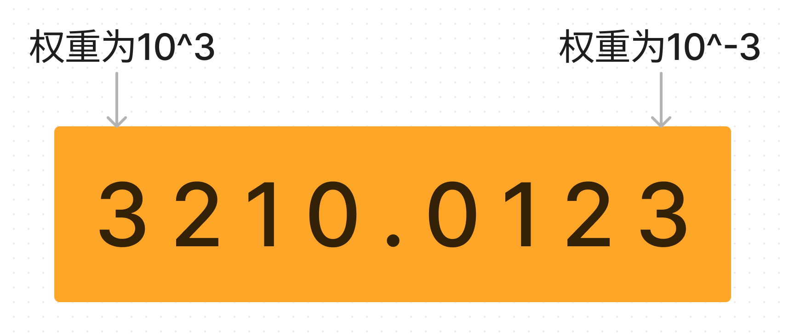
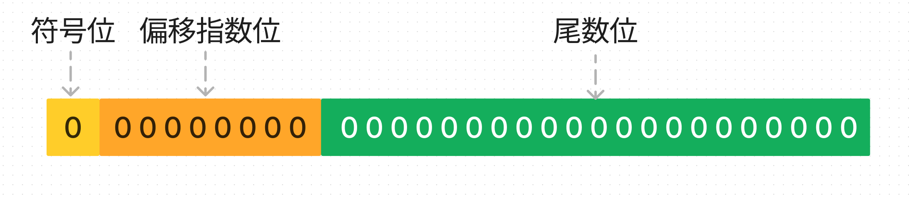
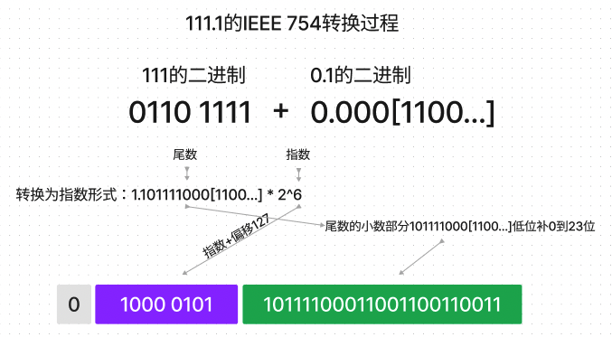

数字，是计算机的根本。

## 进制

通过给单个符号所处的位置赋予权重，产生了进制。进制让我们可以通过简单的几个符号加上不同的排列组合方法，表达出几乎所有的数量。人类常用的进制是十进制，一般认为是因为人类有十个手指头。而二进制因为其状态只有 0 和 1，最容易被计算机模拟。

不同进制之间是可以相互转换的，因为不同进制的数字只是每个位置的权重不同。

## 整数

整数是离散的，在指定范围内的整数个数是确定的，是**唯一**一种计算机天然能够存储的数据。计算机中的整数有如下特点：

1. 根据所占用的空间大小，可以对整数进行区分。例如 short、int、long 等。
2. 可以通过约定某些位带有固定含义，提供更多类型。例如将第一位约定为符号位用来存储负数。
3. 整数类型一般都有范围，占用空间大小决定了其范围大小，计算只能在一定范围内正确。

## 小数

小数由整数除以进制产生，小数部分只有结合进制才有意义。例如整数 1 在不同进制下表达的数量相同，而 0.1 在不同进制下表达的却不一样。同时小数是连续的，0 到 1 之间的小数是无限的，所以计算机通过精度来控制需要表达的小数的数量。

由于计算机只能存储整数，只能通过赋予不同位不同意义来描述一个小数，一般通过 IEEE754 标准用二进制表示一个小数。IEEE754 提供了**四种**精度标准，最常使用的是**单精度浮点数**和**双精度浮点数**。IEEE754 通过三个部分来描述一个小数，分别为：

1. 符号位，用来表示是正数还是负数，单双精度都只占用 1bit。
2. 偏移指数位，32 位单精度占用 8 位，64 位双精度占用 11 位，用来存储指数部分。所谓偏移，只是为了不出现负数更容易进行计算，例如将 8 位指数位能表示的区间[-127,128]加上 127 偏移就是区间[0,255],64 位的偏移则是 1023。之所以指数位使用有符号数加上偏移，而不是直接使用无符号数，是因为负数的指数部分也是负数的。
3. 其余为尾数位，32 位单精度 23 位，64 位双精度 52 位。

以 32 位单精度为例

**如何计算**

以浮点数 111.1 为例子：

首先，将浮点数转化成二进制形式。这个过程中需要将整数部分和小数部分分别转化为二进制数，然后将二者合并。整数部分采用二进制整数转换法，即不断对 2 取余数，最后将余数倒序排列。小数部分采用二进制小数转换法，即不断将小数乘以 2 取整数部分，最后将整数部分排列。

接下来，将浮点数分解成符号位、指数位和尾数位。符号位表示浮点数的正负，指数位表示浮点数的大小，尾数位表示浮点数的精度。

### 精度丢失

**小数精度丢失**

由于浮点数是使用近似表达的，所以无法完全保证小数的准确性。上面的例子中，由于 0.1 在二进制下是一个无限循环小数（0.0001100110011...），因此，无论使用多少位来表示这个数，都无法完全精确地表示 0.1。尾数只有最多 23 位被存储了，剩余部分被丢弃。

**整数溢出精度丢失**

IEEE 754 规定，对于超出浮点数的表示范围的数值，需要进行溢出处理。对于计算结果中的舍入误差，需要根据一定的舍入规则进行舍入。例如，当我们将一个超过 2 的 24 次方的整数存储为 32 位单精度浮点数时，它将被近似为最接近的可表示数，因为超出了可表示的范围。这种近似可能会导致精度丢失。因此，在需要存储大整数时，应该使用适当的数据类型，例如 64 位整数或大数值库，以避免精度丢失。

**解决精度问题**
有如下几个方案：

1. 使用整数运算：将需要进行计算的浮点数转换成整数，然后进行整数运算。这种方法可以保证计算的精度，但需要注意整数溢出的问题。
2. 使用有理数运算：将浮点数转换成有理数，然后进行有理数运算。有理数可以精确地表示分数，因此可以避免浮点数精度丢失的问题。但是，有理数的计算可能会涉及到大量的分数化简和通分计算，因此计算效率较低。
3. 使用高精度数值库：高精度数值库可以提供任意精度的数值计算，可以避免浮点数精度丢失的问题。但是，由于高精度数值库需要进行大量的高精度计算，因此计算效率较低。
4. 使用数值稳定的算法：数值稳定的算法可以避免舍入误差和精度丢失的问题。这种算法通常会将计算结果进行多次迭代，以减小误差。常见的数值稳定算法包括牛顿迭代法和龙格-库塔法等。

需要根据具体的需求和应用场景来选择合适的解决方案。如果需要进行高精度计算并且计算量不是很大，可以考虑使用高精度数值库或者有理数运算。如果需要进行高效率的数值计算，可以使用数值稳定的算法。

### NaN

IEEE 754 定义了特殊的浮点数值，包括无穷大（正无穷大和负无穷大）、NaN（不是一个数字）、正零和负零。这些特殊的浮点数值可以用来表示计算过程中的异常情况，例如除以零或计算出无法表示的结果。

产生 NaN 的情况通常包括以下几种情况：

1. 对 0 进行除法：在 IEEE 754 标准中，除以 0 会产生无限大（正无穷或负无穷），这些值被认为是无效的浮点数值，因此计算结果为 NaN。
2. 对负数进行算术运算，例如求平方根或对数：在实数范围内，负数的平方根和自然对数没有实数解，因此计算结果为 NaN。
3. 非数值的运算：例如 0/0、无限大-无限大等运算会产生 NaN。
4. 未定义的数学运算：例如复数的实数部分或模长等未定义的运算，计算结果也会为 NaN。
5. 使用 NaN 作为输入：当 NaN 作为输入时，它会传递到计算中并传播到输出，最终结果为 NaN。
