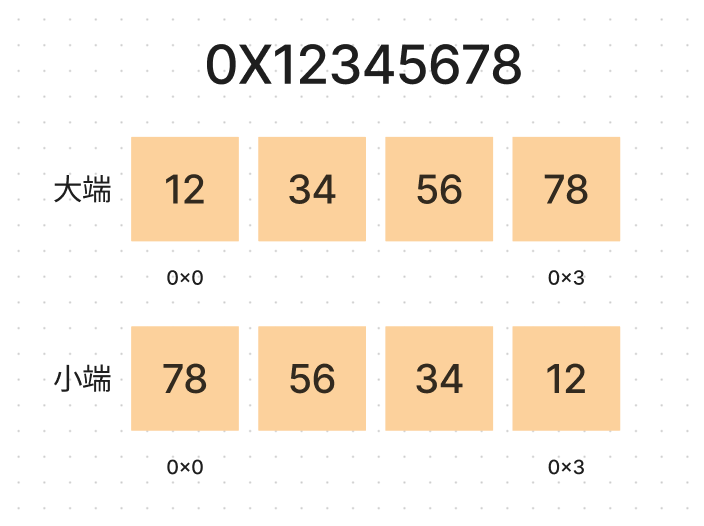

计算机最重要的一个功能是存储。

## bit 与 byte

计算机最小存储单元为一个 bit，通常通过高低电平来代表状态。8 个 bit 组成一个 byte，现代计算机中，byte 是读写的最小单元，**寻址和申请空间也是以 byte 作为最小单位**。我们无法直接操作一个 bit，只能通过语言提供的位操作进行一些相关的操作。

## 堆内存和栈内存

每个进程都会有一个线程内部共享的堆内存，可能动态分配和释放。

对于空间分配有两种方式，一种从栈中分配一般在编译时就确定好。一种从堆内存中分配，这一种是动态分配的，可以通过提供的方法随时申请和释放。

## 进程内存拆分

1. 代码区: 存放应用程序指令。
2. 全局&静态区: 全局变量和静态变量会存储在这个区中，直到进程结束。
3. 常量区: 存储字符串常量，数字常量等无法被运行时改变的量。
4. 堆栈区。

## 代码中的字面量存放在哪里

注意区分字面量和变量的区别，例如 int x = 10，x 是变量，10 是字面量。

1. 如果是赋值给局部变量，能够被存入指令的字面量会直接放入指令中（单字符和数字都可以存入指令），也就是存在于代码区。
2. 赋值给局部变量但无法被存入指令，例如字符串，会存放在常量区，此变量则为字符串在常量区存储的地址。
3. 如果是赋值给全局变量，则都存储在常量区。

## 数据存储大小端

如果一个类型由多个字节组成，那么如何排列这多个字节有两种方向，由 CPU 架构决定。通常由 CPU 数据引脚和地址总线连接方式决定。

现在我们使用的 arm64 和 x86 架构都是小端，大端则存在于 IBM、PowerPC 等的 cpu 架构中。但是网络通讯协议也是使用大端的方式进行数据传输的。

大小端只是多字节类型内部存储方向不同，其首地址和占用字节数在大小端系统下是一致的。

### 比特序

上面我们图中最小单位为 byte，那其中 bit 的顺序是什么样子的呢。

其实 bit 序也是相反的，只不过因为系统屏蔽了 bit 序的一些细节，例如位运算也是透明的，我们在大小端转换时只需要以字节作为最小单位处理即可。

### 只决定多字节单类型的存储顺序

大小端只决定了多字节单个数据的存储顺序，而与不同类型多个数据的存储顺序并无关系。
