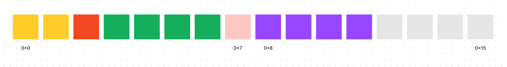
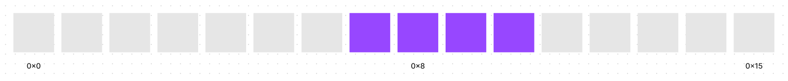
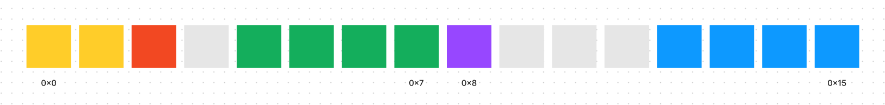
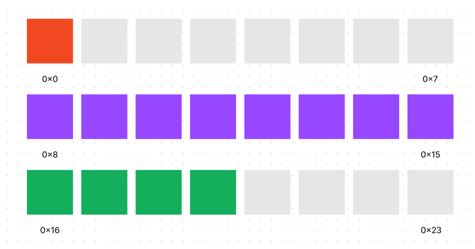
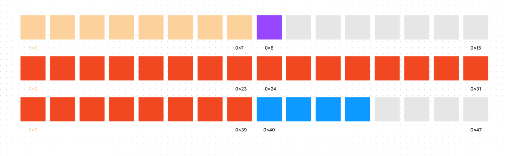

一个类型只能存储一个值，如果一个类型里面能存储其他多个类型的值，那我们就可以组合各种类型生成新的自定义类型。

## 内存对齐

现代应用程序会定义非常多的变量，也就是申请各种长度的空间。以下面的例子说明

```c
short a;
char b;
int c;
char d;
int f;
```

最简单的办法就是根据声明的顺序，依次分配对应的空间，但现实情况一般不是这样的。



### 内存读取粒度

cpu 读取内存时，并不是一次读取一个字节的数据。想象一下，如果我们需要读取 0 地址的一个 8 字节数据，那么我们需要进行八次读取。基本所有的类型都超过一个字节，这样导致我们总是需要多次读取操作才能拿到一个数据。

但是，如果我们将一次读取一个字节修改为一次读取两个字节。我们就可以将读取八字节的次数减少一半。当然，也不是读取越多就越好，读取过多无用数据导致总是需要对数据进行剔除，也会减慢速度。

**默认读取粒度**

一般来说，CPU 一次读取的最大字节与数据总线的位宽相同，在 64 位系统上为 8 个字节，在 32 位上为 4 个字节。这个内存访问粒度通常也被编译器设置为默认对齐大小。

### 新的问题

增大内存读取粒度，可以大幅减少内存读取次数，但是又会带来一个问题。

上面的例子只说了数据起点为 0 的情况，但是起点可以在任何位置。想象一下，我们需要从 0x7 开始读取一个四字节的内存。



如果内存读取粒度为 8，则需要如下几个步骤。

1. 读取 0 到 7 字节
2. 读取 8 到 15 字节
3. 第一个值左移剔除多余字节
4. 第二个值右移剔除多余字节
5. 合并两个值并存储到寄存器

很明显，如果大部分内存读取操作都需要剔除再合并的话，必然会降低 cpu 效率。并且，早期的 cpu 甚至没有对应的指令，遇到这种情况会直接抛出异常。操作系统可以捕获（有一些系统直接不处理）这个异常在软件层面进行处理，但这样速度就更慢了。

### 内存对齐

为了尽量减少上面提到的移动和剔除操作，由编译器在编译时就确定好存储的地址，通过特定规则将变量的首地址尽量分散在 CPU 读取块的头部，这种策略就是内存对齐。这个策略是默认开启的，但是一般编译器也提供了关闭的方法。

对于普通数据类型来说，对齐规则比较简单，只需要让它所处的地址与首地址的偏移量是它的类型占用长度的整数倍即可，所以即便我们连续定义多个不同类型的基本变量，他们中间也会出现填充。

还以我们上面的例子来说明，经过内存对齐后，各个变量在内存中是分散的。



## 结构体类的新类型

有时候我们想要在某个类型中存储相关的多个值，这个时候前面学习的类型就不满足了。

这就是结构体产生的原因，结构体等复合类型的出现，让抽象描述一个事物出现可能，也为后续面向对象的诞生提供了基础。部分语言中，对象本身在底层实现上就是一个自定义的结构体。

结构体的语法大致为

```c
struct NewType {
  3字节类型 a;
  3字节类型 b;
  1字节类型 c;
  4字节类型 d;
}
```

其中每一项为结构体的成员，通过定义一个结构体，我们就定义了一个新的复合类型，这个类型的名字就叫做 NewType。我们可以像使用数字或者字符类型一样来使用我们自己定义的这个新类型。

### 结构体内存对齐

上面我们说了，所有类型默认都会进行对齐操作，从而减少 cpu 读取次数。结构体也一样，它的内存对齐的规则如下

1. 按照声明顺序存储，第一个成员的地址与结构体的地址相同。
2. 每个成员相对于结构体偏移量是该成员或其后代基本类型最大成员占用空间的整数倍。
3. 结构体总大小为 min(编译器对齐大小/可修改,后代基本类型最大成员占用空间)的整数倍。自定义编译器对齐大小能够减少结构体占用空间，但是可能会带来性能问题。因为一般默认大小就是数据总线的大小。

需要注意的是，对齐只以基本类型作为单位，因为所有的复合类型最终都是由基本类型组成。以基本类型进行对齐，能够减少空间的浪费。下面以一个多层嵌套结构体为例：

```c
struct Struct1 {
  char a;
  double b;
  int c;
} struct1;

struct Struct2 {
  double a;
  char b;
  struct Struct1 c;
  int d;
} struct2;

struct Struct3 {
  double a;
  struct Struct2 b;
  struct Struct1 c;
  char d;
} struct3;
```

这里，struct1 内存布局如下


也就是说我们自定义的 struct1 类型，占用的空间为 24 个字节。

struct2 占用空间为

```c
struct Struct2 {
  double a; // 占用从 0~7 八个字节
  char b; // 占用 8 一个字节
  struct Struct1 c; // Struct1最大基本类型为 8字节，总空间为24，所以存储在 16～39
  int d; // 占用 40～43
} struct2;
// 总空间为44个字节，但是不满足第三点，需要填充为48个
```

struct2 内存布局如下



struct3 占用空间为

```c
struct Struct3 {
  double a; // 占用从 0~7 八个字节
  struct Struct2 b; // Struct2最大基本类型为 8字节，总空间为48，所以存储在 8～55
  struct Struct1 c; // Struct1最大基本类型为 8字节，总空间为24，所以存储在 56～79
  char d; // 占用 80 一个字节
} struct3;
// 总空间为81个字节，但是不满足第三点，需要填充为88个
```
