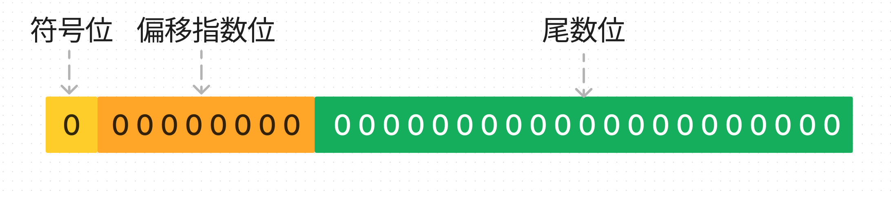

字符串，最基本的变长类型。

## 字符与编码

计算机只能存储数字，那么应该怎么存储一个英文字母或者汉字呢。最简单的办法，就是给每一个英文字母或者汉字都指定一个对应的数字，这个对应关系就是编码表。

计算机底层最常见的编码表是ASCII编码，这个编码表总共定义了128个字符和数字的对应关系，包含了英语的26个字母和大部分键盘上能看到的字符。既然字符在硬盘上存储的也是数字，那我们怎么确定存储在硬盘上的数字代表的是一个字符还是就是一个数字呢。答案是通过类型，在c语言中，一个数字使用int类型赋值则为数字，使用char类型赋值则为ASCII字符。

需要注意的是，在不同的语言中，char类型所占用的长度并不同，因为不同语言使用的编码表不同。在c系列语言中为1个字节，因为使用的是ASCII，在java则为2个字节，因为使用的是unicode编码。

### 什么是unicode
上面我们介绍了ASCII编码表，通过约定char类型的编码表为ASCII，我们能够实现英文字母和部分常见字符的存储和取出。但是，我们无法存储汉字，因为ASCII上面并没有汉字对应数字的对应关系。

因此，我们需要有一个表，上面将所有语言的所有字都对应一个数字，这个表就是unicode表。语言是不断在变化和拓展的，所以unicode表也在一直更新中，截至2023年，最新版本为15.0版本，其规模有十五万个左右的字符，其中包含大量的emoji表情字符。

[unicode官网](https://home.unicode.org)

因为ASCII编码表是固定的，存储128个字符的最小内存单元就是一个字节。所以，采用ASCII编码作为字符编码方式的语言中，一个字符都只占用一个字节。但是，如果一个语言采用unicode编码存储字符，它的字符会占用多大的空间呢？

### 什么是编码空间
由于码表在不断的变大，所以我们需要先约定一个字符对应数字也就是码点的范围，这个范围必须大于现在已经编码的字符的总数，并且还需要考虑到字符不断增长的情况，这个约定的范围就是编码空间。由于ASCII码表是不变的，所以它的编码空间是一个字节。但是unicode编码是一直在变化的，所以编码空间与其版本有关。

现行的unicode版本，将编码空间划分为17个部分。第一部分范围为0-65535，第二部分范围为65536-131071，第十七部分为1048576-1114111，所有最常见的字符都放在第一个范围内（常见汉字在第一部分，生僻字则不在第一部分），所以，如果我们只需要支持常见字符的话，使用两个字节来存储字符即可。要将前面说的十七个部分都存起来需要21位，也就是三个字节。

## 整数

整数是离散的，在指定范围内的整数个数是确定的，是**唯一**一种计算机天然能够存储的数据。计算机中的整数有如下特点：

1. 根据所占用的空间大小，可以对整数进行区分。例如 short、int、long 等。
2. 可以通过约定某些位带有固定含义，提供更多类型。例如将第一位约定为符号位用来存储负数。
3. 整数类型一般都有范围，占用空间大小决定了其范围大小，计算只能在一定范围内正确。

## 小数

小数由整数除以进制产生，小数部分只有结合进制才有意义。例如整数 1 在不同进制下表达的数量相同，而 0.1 在不同进制下表达的却不一样。同时小数是连续的，0 到 1 之间的小数是无限的，所以计算机通过精度来控制需要表达的小数的数量。

由于计算机只能存储整数，只能通过赋予不同位不同意义来描述一个小数，一般通过 IEEE754 标准用二进制表示一个小数。IEEE754 提供了**四种**精度标准，最常使用的是**单精度浮点数**和**双精度浮点数**。IEEE754 通过三个部分来描述一个小数，分别为：

1. 符号位，用来表示是正数还是负数，单双精度都只占用 1bit。
2. 偏移指数位，32 位单精度占用 8 位，64 位双精度占用 11 位，用来存储指数部分。
3. 其余为尾数位，32 位单精度 23 位，64 位双精度 52 位。

以 32 位单精度为例

使用这种方法存储的数字都是不精确的，即便是整数。
